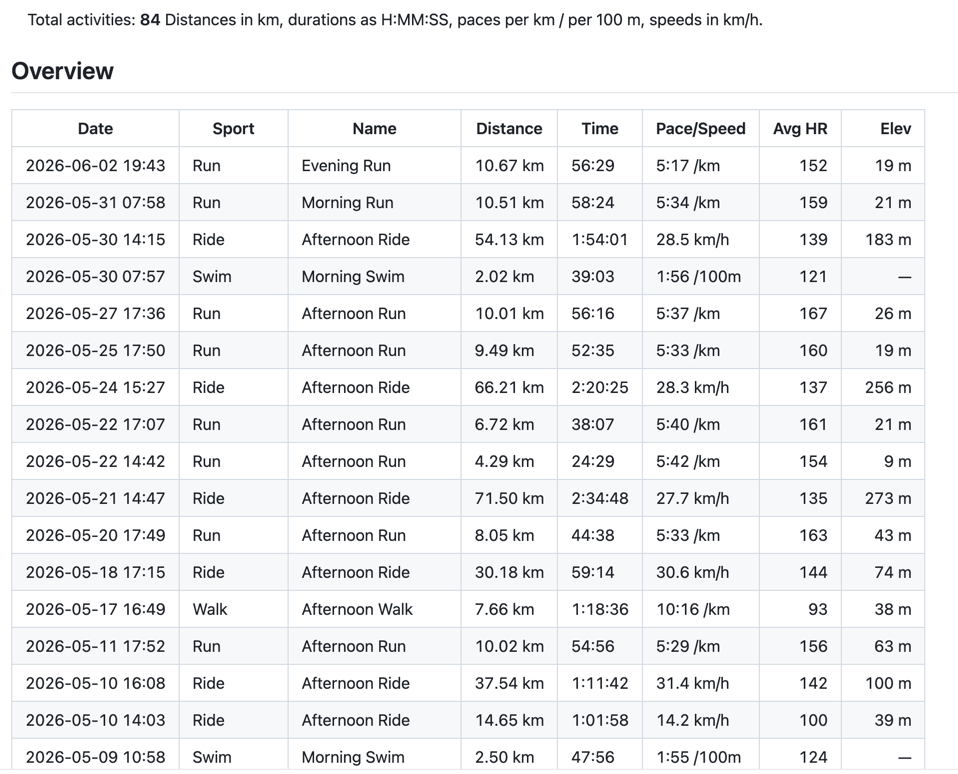
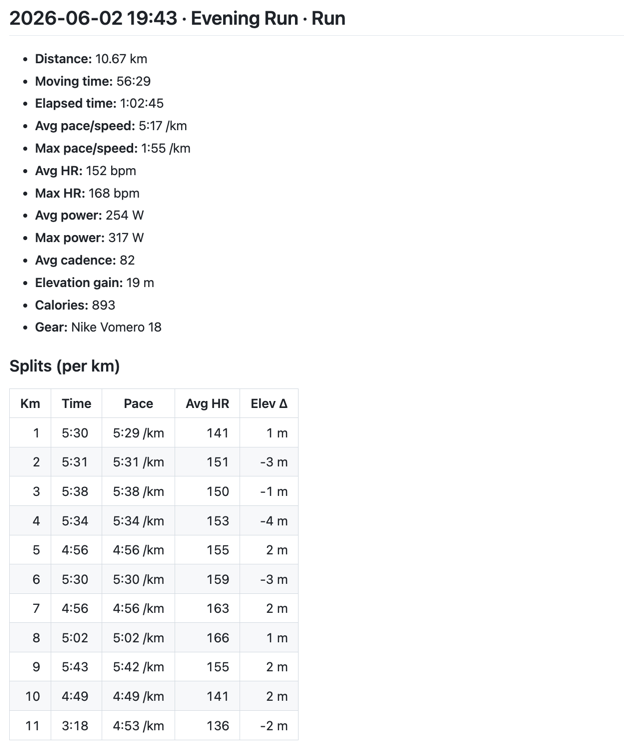

# Strava to LLM

**Export all your [Strava](https://www.strava.com) activities to clean Markdown,
then analyze your training just by chatting with ChatGPT, Claude, or any other LLM.**

For each activity it grabs the full details - per-kilometer splits, heart-rate
zones, power, cadence, elevation, laps, gear and your notes - so the model has
real numbers to reason about, not just a summary.

## Why Markdown?

Because chat models read Markdown tables and headings well. Pasting raw JSON
into a chat works badly; a tidy Markdown file works great. Then you can just
ask things like *"compare my pace in April and May"* or *"is my heart rate
drifting less on long runs than it used to?"*.

## What you get

After a run you'll have (everything lives under `data/`):

```
data/
├── users/<your-client-id>/
│   ├── all_activities.md       # everything in one file - upload this one
│   ├── activities/             # one file per workout
│   │   ├── 2024-05-12-123456-morning-run.md
│   │   └── ...
│   └── tokens.json             # your login token (kept private)
├── coros_mcp/                  # COROS OAuth tokens + reports (per connection)
└── cache/
    ├── strava/                 # raw Strava API responses, reused on re-runs
    └── coros/                  # cached COROS activity detail + laps
```

`all_activities.md` starts with a summary table of every activity, followed by
the full details of each one. The `activities/` folder has the same thing split
into one file per workout, in case the combined file is too big for your chat.

Here's the summary table at the top of `all_activities.md`:



And here's a single activity - metrics, per-kilometer splits, laps and zones:



## What you need

- Python 3.10 or newer
- A Strava account
- A free Strava API application (takes two minutes to create - see below)

## Setup

### 1. Create a Strava API application

1. Open <https://www.strava.com/settings/api>.
2. Create an application. Any name and website will do.
3. Set **Authorization Callback Domain** to exactly `localhost`.
4. Copy your **Client ID** and **Client Secret** - you'll need them next.

### 2. Install

```bash
git clone https://github.com/roman-struchev/strava-to-llm.git
cd strava-to-llm

python -m venv .venv
source .venv/bin/activate        # Windows: .venv\Scripts\activate

pip install -r requirements.txt
```

### 3. Add your credentials

Copy the example file and paste in your Client ID and Secret:

```bash
cp .env.example .env
```

```dotenv
STRAVA_CLIENT_ID=12345
STRAVA_CLIENT_SECRET=abcdef0123456789...
```

### 4. Run it

```bash
python strava_export.py
```

The first time, your browser opens and asks you to allow access to your Strava
activities. Click approve - the script catches the response, saves a login token
under `data/users/<your-client-id>/`, and starts downloading. After that it logs
in on its own, so you only do this once.

## Using it with a chat model

Upload `all_activities.md` (under `data/users/<your-client-id>/`) to ChatGPT,
Claude, etc. (or paste a few files from its `activities/` folder), then ask away.
For example:

- *"Summarize my training over the last 4 weeks. Any signs I'm overdoing it?"*
- *"Look at my long runs - is my heart-rate drift getting better?"*
- *"Make a week-by-week mileage table and point out the biggest jumps."*

If your chat has a small context limit, the combined file might be too large -
upload individual files from the `activities/` folder, or export just a recent
window with `--after`.

## Try it online

A hosted instance runs at [strava.struchev.site](http://strava.struchev.site) - connect your
Strava app there and use it right away, no install needed.

## Optional: web server (for a ChatGPT/Claude data fetch)

`server.py` is a small multi-user web app (the same one hosted above) so a model
can fetch your activities itself. Open the page, enter your Strava **Client ID**
and **Secret**, click **Connect Strava** - it authorizes once and stores your
tokens server-side. Then one endpoint returns the Markdown:

```
GET /export?clientId=YOUR_ID&after=YYYY-MM-DD[&before=...&limit=N]
```

Run your own with `python server.py`, or deploy with the included `Dockerfile`,
`docker-compose.yml` and GitHub Actions workflow. The only requirement: set your
Strava app's **Authorization Callback Domain** to the host you run it on.

The home page also has a **COROS** card (see below): click **Connect COROS** to
authorize with your COROS account, then fetch the Markdown from:

```
GET /coros/export?clientId=YOUR_ID[&after=YYYY-MM-DD&before=...&limit=N&detail=0]
```

## COROS

COROS activities come through COROS's official hosted
[MCP server](https://coros.com/stories/coros-metrics/c/mcp-testing) — there's **no
API application to create** and no client_id/secret. You authorize once with your
normal COROS account, and the exporter renders your activities into the same
Markdown as Strava.

### CLI

```bash
pip install -r requirements.txt          # installs the `mcp` client SDK
python coros_mcp_export.py               # opens the browser to authorize, then exports
python coros_mcp_export.py --after 2026-01-01 --limit 20
python coros_mcp_export.py --no-detail   # summary only (skip per-activity detail + laps)
```

The token is stored under `data/coros_mcp/` and reused (and refreshed) after that.
Output goes to `data/coros_mcp/coros_all_activities.md`. Per-activity detail and laps
are cached by activity id under `data/cache/` (COROS activities never change), so
re-runs are fast; pass `--refresh` to re-fetch.

By default **all history** is fetched (like the Strava exporter). COROS scans the
requested date range server-side, so a full export's summary call is slow and
`--limit` does **not** speed it up (unlike Strava). Narrow it with `--after` (CLI)
or `&after=YYYY-MM-DD` (server) when you only need recent activities quickly.

### What's in the export

COROS's MCP answers in ready-made human-readable prose, so the export keeps that
text and adds a parsed **Overview** table on top:

- **Overview table** — date, sport, location, distance, time, pace/speed, HR.
- **Per activity** (unless `--no-detail`): the full `getActivityDetail` text — HR,
  pace, **grade-adjusted pace**, cadence, power, stride, **elevation gain/loss**,
  training load — plus **lap tables**: your **manual (button) laps** first, then the
  auto splits, Strava-style — 1 km for running/swimming, 5 km for cycling (with
  average speed instead of pace). Detail costs two calls per activity, run
  concurrently across activities (`--concurrency`, default 6); use `--after`/`--limit`
  for long histories.

Grade-adjusted pace, elevation gain/loss and (for some sports) Efficiency Factor
come straight from COROS. Not available: weather — humidity/wind aren't exposed,
and ambient temperature lives only inside the FIT file. A few low-value fields
(calories, max power, max cadence) are stripped from the output.

**Region:** COROS routes each account to a regional MCP endpoint; the default is
EU (`mcpeu.coros.com`). For another region set `COROS_MCP_URL` (or `--mcp-url`) to
the host named in a `Protected resource … does not match …` error.

Diagnostics: `--list-tools` (all tools + schemas), `--raw` (dump a tool result),
`--tool <name> --json '{…}'` (call a specific tool with exact arguments).

### Web server

`server.py` is multi-user like the Strava side. Each **Connect COROS** mints a
capability id and serves `GET /coros/export?clientId=<id>` (add `?detail=0` for
summary only). COROS has no user-supplied client id, so that generated id *is* the
key — anyone with the link can read that connection's data, exactly like a Strava
`clientId` link, so treat it as a secret. Tokens live in `data/coros_mcp/<id>/`.
On the home page the **Last activity** link has a **📋 Copy** button that copies
the export Markdown straight to your clipboard.

**Open the UI at `http://localhost:PORT`, not `http://0.0.0.0:PORT`.** COROS's OAuth
only accepts non-HTTPS callback URLs for loopback hosts, and browsers only expose
the clipboard on a secure context — `localhost` satisfies both; `0.0.0.0` fails at
both. **When deploying to a server, put it behind HTTPS** (a reverse proxy that
forwards `X-Forwarded-Proto`/`X-Forwarded-Host`); then Connect and Copy both work.

## Options

```text
python strava_export.py [options]

      --data DIR          Root for tokens, cache and reports (default: ./data)
      --after YYYY-MM-DD   Only activities on or after this date
      --before YYYY-MM-DD  Only activities before this date
      --limit N           Only the N most recent activities
      --refresh           Download again even if it's already cached
      --summary-only      Quick mode: just the activity list, no splits/zones/laps
      --no-zones          Skip heart-rate/power zones (downloads twice as fast)
      --no-per-activity   Only write the combined file
      --workers N         Activities downloaded in parallel (default: 4, 1 = one at a time)
      --port N            Port for the login redirect (default: 8721)
  -v, --verbose           Show more logging
```

A few handy examples:

```bash
# Quick overview of everything in a few seconds
python strava_export.py --summary-only

# Just this year, fresh data
python strava_export.py --after 2026-01-01 --refresh

# Try it out on your 10 latest activities
python strava_export.py --limit 10
```

## Why it can be slow (and what to do)

The script isn't the bottleneck - Strava is. A new API app is allowed only
**100 requests every 15 minutes** and **1000 per day**. Each activity needs one
or two requests, so if you have a thousand-plus activities, a full export simply
can't finish in a single day. That's a Strava rule, not a bug - once you're up
against the quota, no amount of parallelism buys you anything.

The script handles this for you:

- **It downloads several activities at once.** Below the quota the wait is all
  network, so four requests in flight (`--workers`) finish an export several
  times faster. Strava counts requests, not connections, so this doesn't burn
  any extra quota.

- **It remembers what it already downloaded.** When the daily limit runs out, it
  stops cleanly, writes the file with whatever it has so far, and tells you to
  run it again later. Next time it skips everything it already has and picks up
  where it left off.
- **It skips unnecessary requests.** Heart-rate zones are only fetched for
  activities that actually have a heart rate. Use `--no-zones` to skip them
  completely and roughly halve the work.
- **There's a fast mode.** `--summary-only` uses just the activity list - about
  six requests total - and finishes in seconds. You lose splits, zones and laps,
  but you get distance, time, pace, average heart rate and elevation for every
  activity. Good for a first look.

If you want it genuinely faster, you can ask Strava to raise your app's limit on
the [API settings page](https://www.strava.com/settings/api) - they usually
grant it for normal personal use.

## Your data stays yours

- Nothing is sent anywhere except to Strava to fetch your own data. The files
  are written to your computer. Whatever you later upload to a chat is your call.
- `.env` and the whole `data/` folder (tokens, cache and reports) are in
  `.gitignore`, so you won't accidentally commit your token or your activities.
- The login token file is saved with `0600` permissions (only you can read it).
- The script only asks for read access (`activity:read_all`, including private
  activities). It never changes anything on your Strava account.

